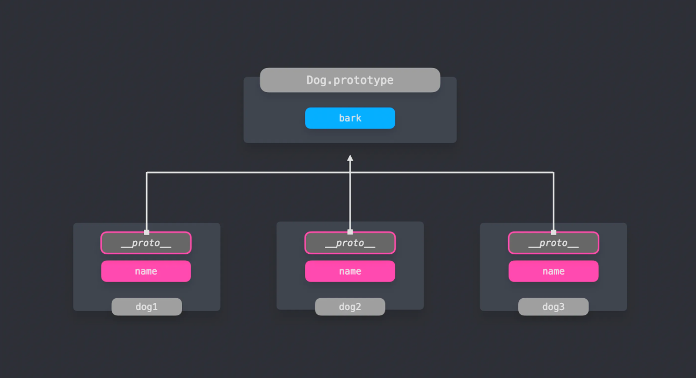

# Prototype 패턴

`프로토타입 패턴`은 동일 타입의 여러 객체들이 프로퍼티를 공유할 때 유용하게 사용합니다.

Prototype은 JS 객체의 기본 속성이므로, Prototype체인을 활용할 수 있습니다.

하나의 앱을 만들때 동일한 타입의 여러 객체를 만든다. ES6 클래스의 여러 인스턴스를 만들어 낼 때 유용하게 사용할 수 있다.

-> dog.js에서
Dog클래스의 생성자에서는 name프로퍼티를 가지고 있고, 클래스 자체적으로는 bark 프로퍼티를 가집니다.
ES6클래스를 사용하면 모든 프로퍼티는 클래스 자체에 선언되며 위의 코드에서 bark는 자동으로 prototype에 추가됩니다.

따라서 생성자의 prototype프로퍼티 혹은 생성된 인스턴스의 `__proto__`프로퍼티를 통해서 Prototype객체를 확인합니다.

---

어떤 인스턴스던 `__protot__`의 값은 Prototype 객체를 가리킨다.
객체에 없는 프로퍼티에 접근하려 하는 경우, JS는 이 프로퍼티가 나타날때 까지 prototye chain을 거슬러 올라간다.

---

Prototype 패턴은 객체들이 같은 프로퍼티를 가져야 하는 경우 유용하게 쓰일 수 있다.
중복된 프로퍼티들이 존재한는 객체를 매번 생성하지 않고, Prototype에 프로퍼티를 추가하면 모든 인스턴스들이 Prototpe 객체를 활용할 수 있다.

---

dog3.js에서 SuperDog는 Dog를 상속했다.
따라서 인스턴스 dog는 bark메서드 역시 호출할 수 있다.
SuperDog의 Prototype 객체의 proto는 Dot.prototype을 가리키고 있다.

Prototype패턴은 어떤 객체가 다른 객체의 프로퍼티를 상속받을 수 있도록 해준다. Prototype체인을 통해 해당 객체에 프로퍼티가 직접 선언되어 있지 않아도 되므로 메서드 중복을 줄이고 이는 메로리 절약도 할 수 있다.
